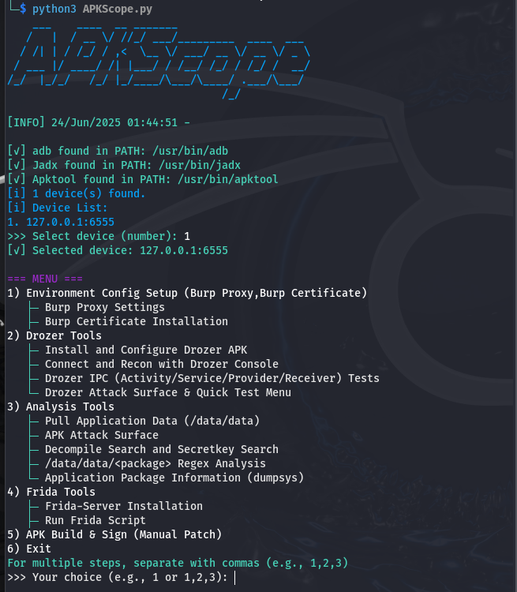
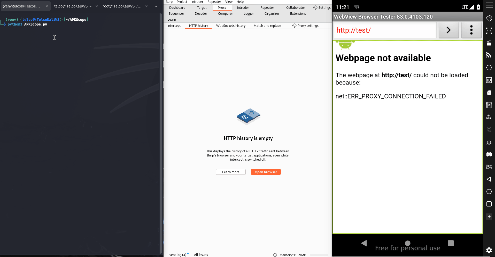
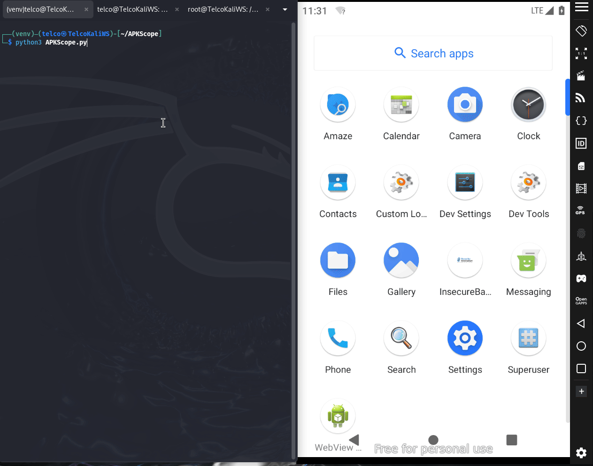

# APKScope

APKScope is a comprehensive and automation-focused tool designed to simplify the security analysis of Android applications. It integrates with popular tools such as ADB, Frida, Drozer, Jadx, and Apktool. You can manage tasks like pulling app data, APK decompilation, attack surface analysis, regex-based key/secret search, running Frida scripts, and more from a single menu.

---

## 🚀 Features

- **Proxy and Certificate Settings:** Set up proxies (e.g., Burp) and install CA certificates on the device.
- **Frida Server Setup & Script Execution:** Downloads and starts the appropriate Frida server for your device, and runs Frida scripts.
- **Drozer Integration:** Downloads and installs Drozer and the Drozer agent APK, sets up port forwarding, and provides console access.
- **APK Attack Surface Analysis:** Decompiles APKs with Apktool, analyzes the manifest and components, lists risky permissions and exported components.
- **Jadx Decompile & Key/Secret Search:** Decompiles APKs with Jadx and searches for keywords or regex patterns.
- **/data/data Regex Analysis:** Searches for keys/secrets in app data using regex.
- **APK Build & Sign:** Automates rebuilding and signing of decompiled APKs.
- **Device Management with ADB:** Lists connected devices and allows you to select one.

---

## 🛠️ Installation

### Requirements

- ADB (Android Platform Tools)
- Jadx and Apktool (can be downloaded automatically on first run)
- Frida and Drozer (can be installed from the menu)

### Installing Dependencies


1. Clone the repository:

```sh
git clone https://github.com/bugraxf/APKScope.git
cd APKScope
```

2. Install the required Python packages:

```sh
pip3 install -r requirements.txt
```

### Running APKScope

```bash
python3 APKScope.py
```

If Jadx or Apktool are missing on first run, you will be prompted to download them automatically.

---

## 📋 Usage

When the program starts, it lists connected devices and asks you to select one. Then, you can choose from the following main menu options:
 
 
### Main Menu

- **1) Environment Config Setup:** Proxy configuration and Burp certificate installation.
- **2) Drozer Tools:** Application analysis and attack surface detection with Drozer.
- **3) Analysis Tools:** Pull app data, APK analysis, regex search, dumpsys info.
- **4) Frida Tools:** Frida server setup and script execution.
- **5) APK Build & Sign:** Rebuild and sign decompiled APKs.
- **6) Exit:** Exit the program.

Each menu contains detailed sub-steps.

---

## 📂 Directory Structure

```
APKScope/
├── APKScope.py
├── tool/
│   ├── jadx/
│   └── apktool/
|   └── frida-server/
|   └── drozer
├── config/
│   ├── regex.json
│   ├── blacklist.json
│   └── signer.json
├── result/
├── decompiled_data/
├── dumped_data/
├── app/
└── script/
```

---

## 🔍 Menu Descriptions

### 1. Environment Config Setup
- Proxy configuration
- Certificate installation (e.g., Burp)
 
### 2. Drozer Tools
- Install Drozer agent and set up port forwarding
- Retrieve app info via Drozer console
- IPC tests and attack surface analysis
  

### 3. Analysis Tools
- Pull app data (/data/data)
- APK attack surface analysis (decompile + manifest analysis)
- Jadx decompile and key/secret search
- /data/data regex analysis
- Retrieve app info with dumpsys

### 4. Frida Tools
- Frida server setup and script execution

### 5. APK Build & Sign
- Rebuild and sign decompiled APKs

### 6. Exit
- Exit the program

---

## ⚙️ Configuration Files

- `config/regex.json`: Regex search rules
- `config/signer.json`: Settings for APK signing
- `config/blacklist.json`: Add patterns to blacklist false positives in regex results

---

## 💡 Notes

- Some operations (e.g., running the Frida server) require root privileges. Ensure you have root access for smooth execution.
- The latest versions of Frida, Drozer, Apktool, and Jadx can be downloaded automatically.
- You can edit the `config/regex.json` file to customize regex searches.
- Analysis results and reports are saved as JSON and text files in the `result/` directory.

---

## 🤝 Contributing

We welcome your pull requests and issues! You can add your own regex rules or analysis modules. Contributions for new tool integrations and improvements are also appreciated.

---

**Warning:** This tool is intended for educational, analytical, and legal penetration testing purposes only. Unauthorized use is unethical and illegal.

---

## 📝 License

MIT License
